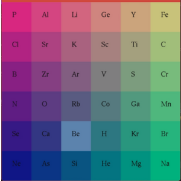

# Mendeleev's Marvel 🌟

Welcome to Mendeleev's Marvel — a 2D grid-based game that combines education and entertainment! Created as a Minor-2 project during my 6th semester, this game is designed to help players explore the periodic table of elements in a fun and interactive way.

## 🧑‍🔬 Game Overview

In Mendeleev's Marvel, the grid is randomly populated with periodic elements and colored grids. The player’s task is to select grids where the elements are consecutive in the periodic table order. If the player selects consecutive elements, they earn points. However, selecting non-consecutive elements ends the game and displays the final score.

The game offers a simple yet engaging way to test your knowledge of the periodic table and hone your reflexes as you strive to make consecutive element selections.

## 🔑 Key Features

Randomized Grids: The game grid is populated randomly with periodic symbols and colorful grid cells, adding unpredictability and excitement.
Periodic Table Challenge: The player must select elements from the grids being in order to score points.
Scoring System: Each correct selection of consecutive elements adds to the score. A wrong selection ends the game.
Educational: Learn about the periodic table while playing!

## 📸 Screenshots

## 🎮 How to Play

Select a Grid: The game starts with a randomly generated grid filled with periodic elements. Choose any grid from the available options.
Choose Consecutive Elements: Select a second grid with an element that is consecutive to the first selected element in the periodic table.
Score Points: For each valid selection of consecutive elements, your score increases.
Game Over: If you select non-consecutive elements, the game ends, and your final score is displayed.

## 📂 Repository Contents

main.cpp: The core file containing all the C++ code for the game, created using openGL, including logic for generating the grid, managing selections, and handling the scoring system.
dataset.txt: A dataset of all elements from the periodic table, used in the game to reference and check consecutive elements.
terminal.txt: Contains terminal commands needed to download and run the game on your system.

## 🚀 Getting Started

Clone the repository:

git clone https://github.com/shahanxali/Mendeleev-s-Marvel

Compile and Run: Follow the instructions in terminal.txt for the necessary terminal commands to download, compile, and run the game.

Play the Game: Start the game and challenge yourself to get a high score.

## 🤝 Contributing

Feel free to fork the repository and suggest any improvements. Ideas such as adding more challenges or implementing different levels based on atomic numbers could enhance the gameplay experience.
🎯 Future Development

Potential features and improvements include:

Timed Challenges: Players must select consecutive elements within a time limit.
Leaderboard: Add a global or local leaderboard to track the highest scores.
Additional Educational Content: Include detailed information about each element in the game.
